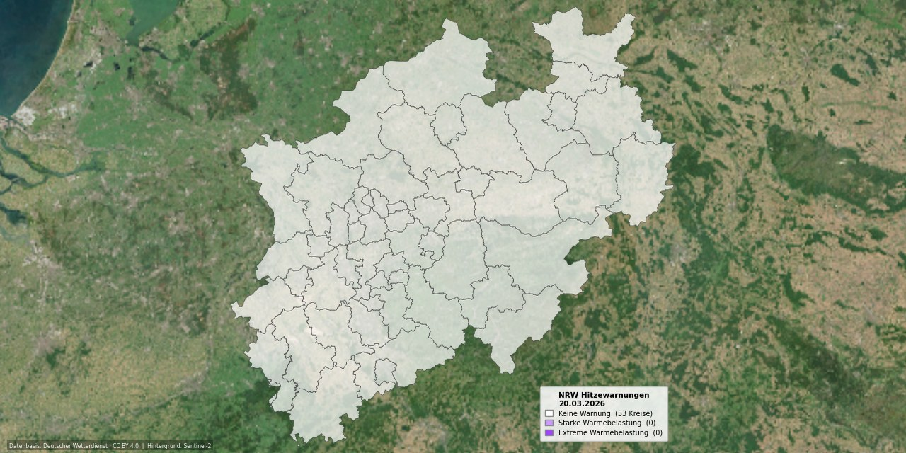

# NRW Hitzewarnungs-Karte

Tägliche automatische Visualisierung der DWD-Hitzewarnungen für alle 53 Kreise und kreisfreien Städte in Nordrhein-Westfalen.



## Funktionsweise

Jeden Morgen um 08:15 UTC startet ein GitHub-Actions-Workflow und durchläuft folgende Schritte:

1. **Datenabruf** – `hwtrend_YYYYMMDD.json` wird direkt vom DWD Open Data Portal geladen. Die Datei erscheint täglich um ca. 08:00 UTC; der 15-minütige Puffer stellt sicher, dass sie vollständig verfügbar ist.
2. **Merge** – Jeder der 53 NRW-Kreise wird über sein AGS-Kürzel auf den zugehörigen DWD-Warnkreis-Schlüssel (CCC) gemappt. Die Zuordnung basiert auf der offiziellen `cap_warncellids.csv` des DWD (Spalte `CCC`, gefiltert auf `BL = NW` und WARNCELLID-Präfix `105`).
3. **Karte** – Das Sentinel-2-Satellitenbild (GeoTIFF, georeferenziert) dient als Hintergrund. Die 53 Kreisflächen werden mit 70 % Deckkraft eingefärbt, je nach Warnstufe des Tages (`Trend[0]`). NRW ist vertikal zentriert und nimmt ca. 620 von 640 Pixeln Höhe ein.
4. **Legende** – Zeigt die aktuellen Warnstufen mit der tagesaktuellen Anzahl betroffener Kreise. Der rechte Legendenrand schließt bündig mit dem östlichen NRW-Rand ab.
5. **Commit** – Die fertige Karte wird als `Hitzekarte_NRW_heute.jpg` (1280 × 640 px) automatisch ins Repository committed.

## Warnstufen

Die DWD-Warnstufen aus `Trend[0]` werden wie folgt dargestellt. Trendwerte (Stufen 3–7) für Folgetage werden auf die nächste Warnstufe gerundet und in der Karte nur für den heutigen Tag (`Trend[0]`) verwendet.

| Stufe | Farbe | Hex | Bedeutung |
|-------|-------|-----|-----------|
| 0 | ⬜ Weiß (70 % Deckkraft) | `#ffffff` | Keine Warnung |
| 1 | 🟣 Hellviolett (70 % Deckkraft) | `#cc99ff` | Starke Wärmebelastung |
| 2 | 🟣 Dunkelviolett (70 % Deckkraft) | `#9e46f8` | Extreme Wärmebelastung |
| 3 | — | — | Hitzetrend aktiv (nicht mehr verwendet → wird als 0 behandelt) |
| 4–5 | wie Stufe 1 | | Hitzetrend: Warnung Stufe 1 gering/wahrscheinlich |
| 6–7 | wie Stufe 2 | | Hitzetrend: Warnung Stufe 2 gering/wahrscheinlich |

## Repo-Struktur

```
├── generate_map.py          # Hauptskript (Datenabruf, Merge, Rendering)
├── requirements.txt         # pip-Abhängigkeiten (kein Conda)
├── landkreise.geojson       # NRW-Kreisgrenzen auf Kreisebene (BKG)
├── background.tiff          # Sentinel-2 True Color Cloudless Mosaic (georef.)
├── Hitzekarte_NRW_heute.jpg # täglich aktualisierte Ausgabe
└── .github/workflows/
    └── hitzekarte.yml       # GitHub Actions Workflow (cron 08:15 UTC)
```

## Datenquellen

| Datensatz | Quelle |
|-----------|--------|
| Hitzewarnungen (täglich) | [DWD Open Data – Heat Forecasts](https://opendata.dwd.de/climate_environment/health/forecasts/heat/) |
| Formatbeschreibung hwtrend JSON | [Beschreibung_hwtrend_json.pdf](https://opendata.dwd.de/climate_environment/health/forecasts/heat/Beschreibung_hwtrend_json.pdf) |
| Warnkreis-Schlüssel (CCC-Mapping) | [DWD CAP Warncell-IDs (cap_warncellids.csv)](https://www.dwd.de/DE/leistungen/opendata/help/warnungen/cap_warncellids_csv.html) |
| Satellitenbild | Sentinel-2 Quarterly Mosaics True Color Cloudless, via Sentinel Hub |
| Kreisgrenzen | BKG – Bundesamt für Kartographie und Geodäsie |

## Lizenz

**DWD-Daten:** [Creative Commons BY 4.0 (CC BY 4.0)](https://creativecommons.org/licenses/by/4.0/)

> Datenbasis: Deutscher Wetterdienst, eigene Elemente ergänzt. Lizenz: [CC BY 4.0](https://creativecommons.org/licenses/by/4.0/)

Weitere Informationen zu den rechtlichen Hinweisen des DWD: [dwd.de/rechtliche_hinweise](https://www.dwd.de/DE/service/rechtliche_hinweise/rechtliche_hinweise_node.html)
