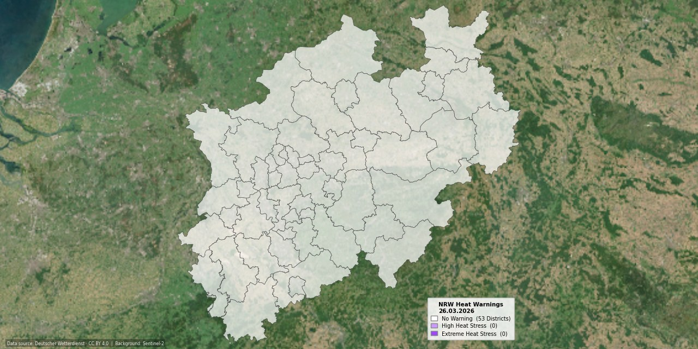

# NRW Heat Warning Map

Daily automated visualization of DWD (German Weather Service) heat warnings for all 53 districts and independent cities in North Rhine-Westphalia.



## How It Works

Every morning at 08:15 UTC, a GitHub Actions workflow triggers and executes the following steps:

1.  **Data Retrieval** – `hwtrend_YYYYMMDD.json` is downloaded directly from the DWD Open Data Portal. The file is usually published around 08:00 UTC; the 15-minute buffer ensures it is fully available.
2.  **Merge** – Each of the 53 NRW districts is mapped to its corresponding DWD warning cell ID (CCC) via its AGS code. This assignment is based on the official DWD `cap_warncellids.csv` (column `CCC`, filtered for `BL = NW` and WARNCELLID prefix `105`).
3.  **Map Generation** – A Sentinel-2 satellite image (GeoTIFF, georeferenced) serves as the background. The 53 district areas are overlaid with 70% opacity, colored according to the day's warning level (`Trend[0]`). NRW is vertically centered, occupying approximately 620 of the 640-pixel height.
4.  **Legend** – Displays the current warning levels along with the daily count of affected districts. The right edge of the legend is flush with the eastern border of NRW.
5.  **Commit** – The final map is automatically committed to the repository as `Hitzekarte_NRW_heute.jpg` (1280 × 640 px).

## Warning Levels

The DWD warning levels from `Trend[0]` are represented as follows. Trend values (levels 3–7) for subsequent days are rounded to the nearest warning level and used in the map only for the current day (`Trend[0]`).

| Level | Color | Hex | Meaning |
|-------|-------|-----|-----------|
| 0 | ⬜ White (70% Opacity) | `#ffffff` | No warning |
| 1 | 🟣 Light Purple (70% Opacity) | `#cc99ff` | Strong heat stress |
| 2 | 🟣 Dark Purple (70% Opacity) | `#9e46f8` | Extreme heat stress |
| 3 | — | — | Heat trend active (no longer used → treated as 0) |
| 4–5 | Same as Level 1 | | Heat trend: Level 1 warning low/likely |
| 6–7 | Same as Level 2 | | Heat trend: Level 2 warning low/likely |

## Repository Structure

```
├── generate_map.py          # Main script (Data retrieval, merging, rendering)
├── requirements.txt         # pip dependencies (no Conda)
├── landkreise.geojson       # NRW district boundaries (BKG)
├── background.tiff          # Sentinel-2 True Color Cloudless Mosaic (georef.)
├── heat-warning-map-nrw-today.jpg # Daily updated output image
└── .github/workflows/
    └── main.yml       # GitHub Actions Workflow (cron 08:15 UTC)
```

## Data Sources

| Dataset | Source |
|-----------|--------|
| Heat Warnings (Daily) | [DWD Open Data – Heat Forecasts](https://opendata.dwd.de/climate_environment/health/forecasts/heat/) |
| Format Description (hwtrend JSON) | [Beschreibung\_hwtrend\_json.pdf](https://opendata.dwd.de/climate_environment/health/forecasts/heat/Beschreibung_hwtrend_json.pdf) |
| Warning Cell Mapping (CCC) | [DWD CAP Warncell-IDs (cap\_warncellids.csv)](https://www.dwd.de/DE/leistungen/opendata/help/warnungen/cap_warncellids_csv.html) |
| Satellite Imagery | Sentinel-2 Quarterly Mosaics True Color Cloudless, via Sentinel Hub |
| District Boundaries | BKG – Federal Agency for Cartography and Geodesy |

## License

**DWD Data:** [Creative Commons BY 4.0 (CC BY 4.0)](https://creativecommons.org/licenses/by/4.0/)

> Database: Deutscher Wetterdienst (German Weather Service), own elements added. License: [CC BY 4.0](https://creativecommons.org/licenses/by/4.0/)

Further information regarding DWD legal notices: [dwd.de/legal\_notices](https://www.dwd.de/DE/service/rechtliche_hinweise/rechtliche_hinweise_node.html)
